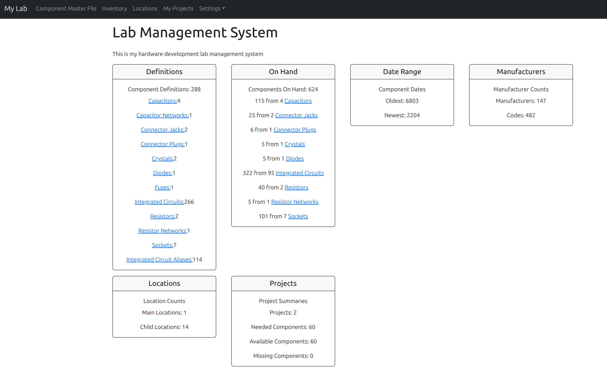

# ChipInventory

## A simple lab inventory management system for integrated circuits and other usefull items. 

This system is written in node.js with express and pug.  The data is stored in a MySql database. 
The layout uses bootstrap CSS.

Includes data from the [ChipDb](https://www.msarnoff.org/chipdb/) project by Matt Sarnoff and it's 
source data [github repository](https://github.com/74hc595/chipdb).

# Installation
The application can be cloned from this git repository.  It includes an initial database load of component defintions along with my inventory, location and project data.
## Setup the Database
You will need a MySQL/Maria DB database server setup.

Using a tool such as MySQL Workbench, connect to the database server with an admin user and run these commands to create the initial database and application user.  
```
CREATE DATABASE chip_data;
CREATE USER 'chip_app'@'localhost' IDENTIFIED BY 'password';
GRANT SELECT, INSERT, UPDATE, DELETE, CREATE, DROP, RELOAD, REFERENCES, INDEX, ALTER, CREATE VIEW, SHOW VIEW ON chip_data.* TO `chip_app`@`localhost`;
FLUSH PRIVILEGES;
```
Be sure to note the actual password you use so you can put it iont the .env file below.

## Download and setup the code
Clone the git repository and in the directory do the following to load all the dependencies
```
npm install
```
This will install the dependencies in the project directory and should not impact any other projects.

Create a file named .env in the root project folder to hold the database connection information.  Be sure to put in the password you used when you created the chip_app user above.
```
MYSQL_HOST="127.0.0.1"
MYSQL_USER='chip_app'
MYSQL_PASSWORD=''
MYSQL_DATABASE='chip_data'
```
## Load the initial data
The easiest way is to use MySQL Workbench and import the data from the project's database folder into the chip_data database.  The workbench handles creating all the schmas and loading the data while managing all of the foreign key relationships.

Eventually we will release the system without my inventory related data.  Until then, to remove my inventory, project and location information from the system run the following SQL statements:
```
DELETE FROM project_items WHERE 1 = 1;
DELETE FROM project_boms where 1 = 1;
DELETE FROM projects WHERE 1 = 1;
DELETE FROM inventory_dates WHERE 1 = 1;
DELETE FROM inventory WHERE 1 = 1;
DELETE FROM locations WHERE 1 = 1;
COMMIT;
```
# Launch the application
You can start the application with this command
```
npm run dev
```
Any errors and console logs will appear in the terminal window.
The system will restart it after every code change is saved.

The application can be reached in your browser on localhost port 3000. 



# Application Instruction
Here will be how to use the variious sections.
